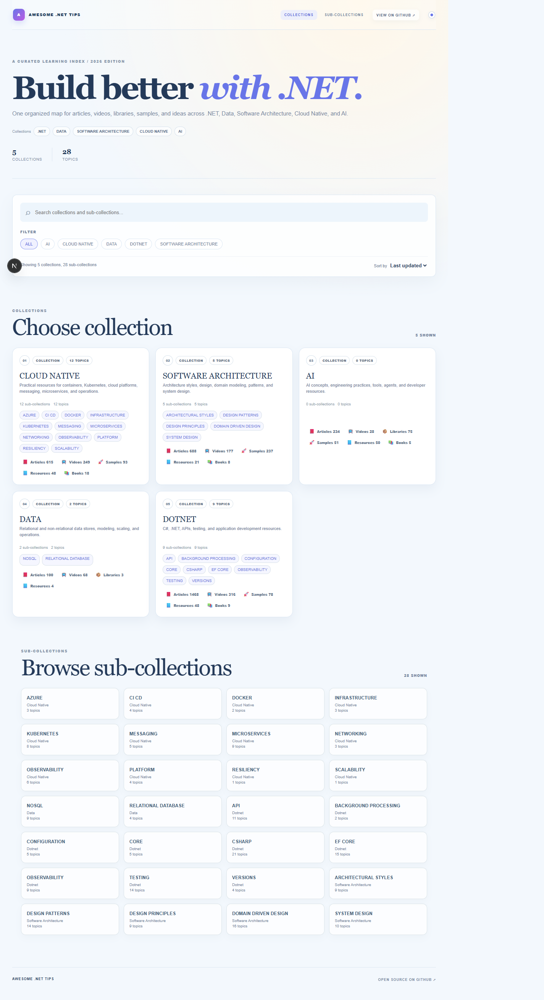

# Awesome .Net Tips

> A curated list of awesome tips and tricks, resources, videos and articles in .NET, Software Architecture, Cloud-Native, Data and AI.

## Web Explorer

Browse the collection through the [live web page](https://meysamhadeli.github.io/awesome-dotnet-tips/).

The site deploys automatically from `main` through GitHub Pages. Set **Pages > Build and deployment > Source** to **GitHub Actions** in repository settings.

## Contents

- [.NET](docs/dotnet)
  - [Csharp](docs/dotnet/csharp/csharp.md)
    - [Async](docs/dotnet/csharp/async/async.md)
    - [Collections](docs/dotnet/csharp/collections/collections.md)
    - [Versions](docs/dotnet/csharp/versions)
      - [C# 7](docs/dotnet/csharp/versions/7.md)
      - [C# 8](docs/dotnet/csharp/versions/8.md)
      - [C# 9](docs/dotnet/csharp/versions/9.md)
      - [C# 10](docs/dotnet/csharp/versions/10.md)
      - [C# 11](docs/dotnet/csharp/versions/11.md)
      - [C# 12](docs/dotnet/csharp/versions/12.md)
      - [C# 13](docs/dotnet/csharp/versions/13.md)
      - [C# 14](docs/dotnet/csharp/versions/14.md)
  - [API](docs/dotnet/api)
    - [Action Filters](docs/dotnet/api/action-filters.md)
    - [API Documentation](docs/dotnet/api/api-documentation.md)
    - [API Versioning](docs/dotnet/api/api-versioning.md)
    - [Blazor](docs/dotnet/api/blazor.md)
    - [GraphQL](docs/dotnet/api/graphql.md)
    - [gRPC](docs/dotnet/api/grpc.md)
    - [Minimal API](docs/dotnet/api/minimal-api.md)
    - [OData](docs/dotnet/api/odata.md)
    - [Rate Limit](docs/dotnet/api/rate-limit.md)
    - [REST](docs/dotnet/api/rest.md)
    - [Web API](docs/dotnet/api/web-api.md)
  - [Background Processing](docs/dotnet/background-processing)
    - [Background Tasks](docs/dotnet/background-processing/background-tasks.md)
    - [Hosted Service](docs/dotnet/background-processing/hosted-service.md)
  - [Configuration](docs/dotnet/configuration/configuration.md)
    - [Dependency Injection](docs/dotnet/configuration/dependency-injection.md)
    - [Dotnet Template](docs/dotnet/configuration/dotnet-template.md)
    - [Environment](docs/dotnet/configuration/environment.md)
    - [Localization](docs/dotnet/configuration/localization.md)
  - [Core](docs/dotnet/core)
    - [Best Practice](docs/dotnet/core/best-practice.md)
    - [Dotnet Core](docs/dotnet/core/dotnet-core.md)
    - [Dotnet Core Architecture](docs/dotnet/core/dotnet-core-architecture.md)
    - [Dotnet Core Tips](docs/dotnet/core/dotnet-core-tips.md)
    - [Roadmap](docs/dotnet/core/roadmap.md)
  - [EF Core](docs/dotnet/ef-core/ef-core.md)
    - [Audit](docs/dotnet/ef-core/audit.md)
    - [Eager Loading](docs/dotnet/ef-core/eager-loading.md)
    - [EF Core 5](docs/dotnet/ef-core/ef-core5.md)
    - [EF Core 6](docs/dotnet/ef-core/ef-core6.md)
    - [EF Core 7](docs/dotnet/ef-core/ef-core7.md)
    - [EF Core 8](docs/dotnet/ef-core/ef-core8.md)
    - [EF Core Migration](docs/dotnet/ef-core/ef-core-migration.md)
    - [Explicit Loading](docs/dotnet/ef-core/explicit-loading.md)
    - [Expression Tree](docs/dotnet/ef-core/expression-tree.md)
    - [Lazy Loading](docs/dotnet/ef-core/lazy-loading.md)
    - [Migration](docs/dotnet/ef-core/migration.md)
    - [Optimistic Concurrency](docs/dotnet/ef-core/optimistic-concurrency.md)
    - [Performance](docs/dotnet/ef-core/performance.md)
    - [Transaction](docs/dotnet/ef-core/transaction.md)
  - [Observability](docs/dotnet/observability)
    - [Caching](docs/dotnet/observability/caching.md)
    - [Exception Handling](docs/dotnet/observability/exception-handling.md)
    - [Health Check](docs/dotnet/observability/health-check.md)
    - [HttpClient](docs/dotnet/observability/httpclient.md)
    - [HttpContext](docs/dotnet/observability/httpcontext.md)
    - [Logging](docs/dotnet/observability/logging.md)
    - [Middleware](docs/dotnet/observability/middleware.md)
    - [Performance](docs/dotnet/observability/performance.md)
    - [SignalR](docs/dotnet/observability/signalr.md)
  - [Testing](docs/dotnet/testing/testing.md)
    - [Acceptance Testing](docs/dotnet/testing/acceptance-testing.md)
    - [Architectural Testing](docs/dotnet/testing/architectural-testing.md)
    - [BDD](docs/dotnet/testing/bdd.md)
    - [Contract Testing](docs/dotnet/testing/contract-testing.md)
    - [E2E Testing](docs/dotnet/testing/e2e-testing.md)
    - [Integration Testing](docs/dotnet/testing/integration-testing.md)
    - [Load Testing](docs/dotnet/testing/load-testing.md)
    - [Mocking](docs/dotnet/testing/mocking.md)
    - [TDD](docs/dotnet/testing/tdd.md)
    - [Test Host](docs/dotnet/testing/test-host.md)
    - [TUnit](docs/dotnet/testing/tunit.md)
    - [Unit Testing](docs/dotnet/testing/unit-testing.md)
    - [xUnit](docs/dotnet/testing/xunit.md)
  - [Versions](docs/dotnet/versions)
    - [.NET 5](docs/dotnet/versions/dotnet5.md)
    - [.NET 6](docs/dotnet/versions/dotnet6.md)
    - [.NET 7](docs/dotnet/versions/dotnet7.md)
    - [.NET 8](docs/dotnet/versions/dotnet8.md)
    - [.NET 9](docs/dotnet/versions/dotnet9.md)
    - [.NET 10](docs/dotnet/versions/dotnet10.md)

- [Data](docs/data)
  - [NoSQL](docs/data/nosql/nosql.md)
    - [Cassandra](docs/data/nosql/cassandra.md)
    - [CosmosDB](docs/data/nosql/cosmosdb.md)
    - [DocumentDB](docs/data/nosql/documentdb.md)
    - [DynamoDB](docs/data/nosql/dynamodb.md)
    - [MongoDB](docs/data/nosql/mongodb.md)
    - [RavenDB](docs/data/nosql/ravendb.md)
    - [Replication](docs/data/nosql/replication.md)
    - [Sharding](docs/data/nosql/sharding.md)
  - [Relational Database](docs/data/relational-database/relational-database.md)
    - [PostgreSQL](docs/data/relational-database/postgresql.md)
    - [Replication](docs/data/relational-database/replication.md)
    - [SQL Server](docs/data/relational-database/sqlserver.md)
- [Software Architecture](docs/software-architecture)
  - [Architectural Styles](docs/software-architecture/architectural-styles/architectural-styles.md)
    - [Clean Architecture](docs/software-architecture/architectural-styles/clean-architecture.md)
    - [Data-Driven Design](docs/software-architecture/architectural-styles/data-driven-design.md)
    - [Event-Driven Architecture](docs/software-architecture/architectural-styles/event-driven-architecture.md)
    - [Hexagonal Architecture](docs/software-architecture/architectural-styles/hexagonal-architecture.md)
    - [N-Layer Architecture](docs/software-architecture/architectural-styles/nlayer-architecture.md)
    - [Onion Architecture](docs/software-architecture/architectural-styles/onion-architecture.md)
    - [Vertical Slice Architecture](docs/software-architecture/architectural-styles/vertical-slice-architecture.md)
    - [Architectural Patterns](docs/software-architecture/architectural-styles/architectural-patterns)
      - [CQRS](docs/software-architecture/architectural-styles/architectural-patterns/cqrs.md)
      - [Event Sourcing](docs/software-architecture/architectural-styles/architectural-patterns/event-sourcing.md)
      - [Modular Monolith](docs/software-architecture/architectural-styles/architectural-patterns/modular-monolith.md)
  - [Design Patterns](docs/software-architecture/design-patterns/design-patterns.md)
    - [Adapter Pattern](docs/software-architecture/design-patterns/adapter-pattern.md)
    - [Builder](docs/software-architecture/design-patterns/builder.md)
    - [Chain of Responsibility](docs/software-architecture/design-patterns/chain-of-responsibility.md)
    - [Command Pattern](docs/software-architecture/design-patterns/command-pattern.md)
    - [Decorator Pattern](docs/software-architecture/design-patterns/decorator-pattern.md)
    - [Factory Pattern](docs/software-architecture/design-patterns/factory-pattern.md)
    - [Mediator Pattern](docs/software-architecture/design-patterns/mediator-pattern.md)
    - [Query Object Pattern](docs/software-architecture/design-patterns/query-object-pattern.md)
    - [Repository Pattern](docs/software-architecture/design-patterns/repository-pattern.md)
    - [Service Locator](docs/software-architecture/design-patterns/service-locator.md)
    - [Singleton](docs/software-architecture/design-patterns/singleton.md)
    - [Specification Pattern](docs/software-architecture/design-patterns/specification-pattern.md)
    - [Strategy Pattern](docs/software-architecture/design-patterns/strategy-pattern.md)
  - [Design Principles](docs/software-architecture/design-principles/design-principles.md)
    - [CAP Theorem](docs/software-architecture/design-principles/cap-theorem.md)
    - [Cohesion and Coupling](docs/software-architecture/design-principles/cohesion-coupling.md)
    - [DRY](docs/software-architecture/design-principles/dry.md)
    - [Encapsulation](docs/software-architecture/design-principles/encapsulation.md)
    - [Fail Fast](docs/software-architecture/design-principles/fail-fast.md)
    - [KISS](docs/software-architecture/design-principles/kiss.md)
    - [SOLID](docs/software-architecture/design-principles/solid.md)
    - [YAGNI](docs/software-architecture/design-principles/yagni.md)
  - [Domain-Driven Design](docs/software-architecture/domain-driven-design/domain-driven-design.md)
    - [Aggregation](docs/software-architecture/domain-driven-design/aggregation.md)
    - [Anemic Domain Model](docs/software-architecture/domain-driven-design/anemic-domain-model.md)
    - [Application Service](docs/software-architecture/domain-driven-design/application-service.md)
    - [Bounded Context](docs/software-architecture/domain-driven-design/bounded-context.md)
    - [Domain Events](docs/software-architecture/domain-driven-design/domain-events.md)
    - [Domain Modeling](docs/software-architecture/domain-driven-design/domain-modeling.md)
    - [Domain Primitives](docs/software-architecture/domain-driven-design/domain-primitives.md)
    - [Integration Event](docs/software-architecture/domain-driven-design/integration-event.md)
    - [Strategic Design](docs/software-architecture/domain-driven-design/strategic-design.md)
    - [Tactical Design](docs/software-architecture/domain-driven-design/tactical-design.md)
    - [Value Objects](docs/software-architecture/domain-driven-design/value-objects.md)
  - [System Design](docs/software-architecture/system-design/system-design.md)
    - [Instagram](docs/software-architecture/system-design/instagram.md)
    - [LinkedIn](docs/software-architecture/system-design/linkedin.md)
    - [Netflix](docs/software-architecture/system-design/netflix.md)
    - [Spotify](docs/software-architecture/system-design/spotify.md)
    - [Telegram](docs/software-architecture/system-design/telegram.md)
    - [TikTok](docs/software-architecture/system-design/tiktok.md)
    - [Twitter](docs/software-architecture/system-design/twitter.md)
    - [URL Shortener](docs/software-architecture/system-design/url-shortener.md)
- [Cloud Native](docs/cloud-native)
  - [Azure](docs/cloud-native/azure/azure.md)
    - [Azure Functions](docs/cloud-native/azure/azure-function.md)
    - [Azure Service Bus](docs/cloud-native/azure/azure-service-bus.md)
  - [CI/CD](docs/cloud-native/ci-cd/ci-cd.md)
    - [Azure DevOps](docs/cloud-native/ci-cd/azure-devops.md)
    - [GitHub Actions](docs/cloud-native/ci-cd/github-actions.md)
    - [Jenkins](docs/cloud-native/ci-cd/jenkins.md)
  - [Docker](docs/cloud-native/docker/docker.md)
    - [Docker Compose](docs/cloud-native/docker/docker-compose.md)
  - [Infrastructure](docs/cloud-native/infrastructure)
    - [Infrastructure as a Service](docs/cloud-native/infrastructure/infrastructure-as-a-service.md)
    - [Pulumi](docs/cloud-native/infrastructure/pulumi.md)
    - [Terraform](docs/cloud-native/infrastructure/terraform.md)
  - [Kubernetes](docs/cloud-native/kubernetes/kubernetes.md)
    - [ConfigMaps](docs/cloud-native/kubernetes/configmaps.md)
    - [Helm](docs/cloud-native/kubernetes/helm.md)
    - [Ingress Controller](docs/cloud-native/kubernetes/ingress-controller.md)
    - [K3s](docs/cloud-native/kubernetes/k3s.md)
    - [Kind](docs/cloud-native/kubernetes/kind.md)
    - [Minikube](docs/cloud-native/kubernetes/minikube.md)
    - [TLS](docs/cloud-native/kubernetes/tls.md)
  - [Messaging](docs/cloud-native/messaging/messaging.md)
    - [Kafka](docs/cloud-native/messaging/kafka.md)
    - [NATS](docs/cloud-native/messaging/nats.md)
    - [RabbitMQ](docs/cloud-native/messaging/rabbitmq.md)
    - [ZeroMQ](docs/cloud-native/messaging/zeromq.md)
  - [Microservices](docs/cloud-native/microservices/microservices.md)
    - [BFF](docs/cloud-native/microservices/bff.md)
    - [CDN](docs/cloud-native/microservices/cdn.md)
    - [Communication](docs/cloud-native/microservices/communication.md)
    - [Composite UI](docs/cloud-native/microservices/composite-ui.md)
    - [Distributed Lock](docs/cloud-native/microservices/distributed-lock.md)
    - [Outbox Pattern](docs/cloud-native/microservices/outbox-pattern.md)
    - [Saga](docs/cloud-native/microservices/saga.md)
    - [Tools](docs/cloud-native/microservices/tools/tools.md)
      - [Aspire](docs/cloud-native/microservices/tools/aspire.md)
      - [CAP](docs/cloud-native/microservices/tools/cap.md)
      - [Dapr](docs/cloud-native/microservices/tools/dapr.md)
      - [MassTransit](docs/cloud-native/microservices/tools/mass-transit.md)
      - [Steeltoe](docs/cloud-native/microservices/tools/steeltoe.md)
      - [Tye](docs/cloud-native/microservices/tools/tye.md)
      - [Wolverine](docs/cloud-native/microservices/tools/wolworine.md)
  - [Networking](docs/cloud-native/networking)
    - [Reverse Proxy](docs/cloud-native/networking/reverse-proxy/reverse-proxy.md)
      - [Kong](docs/cloud-native/networking/reverse-proxy/kong.md)
      - [Load Balancer](docs/cloud-native/networking/reverse-proxy/load-balancer/load-balancer.md)
      - [NGINX](docs/cloud-native/networking/reverse-proxy/nginx.md)
      - [Ocelot](docs/cloud-native/networking/reverse-proxy/ocelot.md)
      - [Traefik](docs/cloud-native/networking/reverse-proxy/traefik.md)
      - [YARP](docs/cloud-native/networking/reverse-proxy/yarp.md)
    - [Service Discovery](docs/cloud-native/networking/service-discovery/service-discovery.md)
      - [Consul](docs/cloud-native/networking/service-discovery/consul.md)
    - [Service Mesh](docs/cloud-native/networking/service-mesh/service-mesh.md)
      - [Envoy](docs/cloud-native/networking/service-mesh/envoy.md)
      - [Istio](docs/cloud-native/networking/service-mesh/istio.md)
      - [Linkerd](docs/cloud-native/networking/service-mesh/linkerd.md)
  - [Observability](docs/cloud-native/observability/observability.md)
    - [Diagnostics](docs/cloud-native/observability/diagnostics.md)
    - [Distributed Tracing](docs/cloud-native/observability/distributed-tracing.md)
    - [Distributed Transactions](docs/cloud-native/observability/distributed-transactions.md)
    - [Logging](docs/cloud-native/observability/logging.md)
    - [Metrics](docs/cloud-native/observability/metrics.md)
  - [Platform](docs/cloud-native/platform)
    - [Heroku](docs/cloud-native/platform/heroku.md)
    - [Netlify](docs/cloud-native/platform/netlify.md)
    - [Platform as a Service](docs/cloud-native/platform/platform-as-a-service.md)
    - [Rancher](docs/cloud-native/platform/rancher.md)
  - [Resiliency](docs/cloud-native/resiliency/resiliency.md)
  - [Scalability](docs/cloud-native/scalability)
    - [Scaling](docs/cloud-native/scalability/scaling.md)
- [AI](docs/ai/ai.md)
  - [A2A](docs/ai/a2a.md)
  - [ACP](docs/ai/acp.md)
  - [Agent](docs/ai/agent.md)
  - [Agents Coding](docs/ai/agents-coding.md)
  - [AI Design](docs/ai/ai-design.md)
  - [AI Gateway](docs/ai/ai-gateway.md)
  - [AI Infrastructure](docs/ai/ai-infrastructure.md)
  - [AI Security](docs/ai/ai-security.md)
  - [AI Tools](docs/ai/ai-tools.md)
  - [Embedding and Vector](docs/ai/embedding-vector.md)
  - [Evaluation and Test](docs/ai/evaluation-test.md)
  - [Graph Database](docs/ai/graph-database.md)
  - [Harness Engineering](docs/ai/harness-engineering.md)
  - [Lamma.cpp](docs/ai/lamma.cpp.md)
  - [LangChain](docs/ai/langchain.md)
  - [Loop Engineering](docs/ai/loop-engineering.md)
  - [MCP](docs/ai/mcp.md)
  - [MEAI](docs/ai/meai.md)
  - [Memory](docs/ai/memory.md)
  - [Microsoft Agent Framework](docs/ai/microsoft-agent-framework.md)
  - [ML.NET](docs/ai/ml.net.md)
  - [Models](docs/ai/models.md)
  - [Ollama](docs/ai/ollama.md)
  - [Prompt Engineering](docs/ai/prompt-engineering.md)
  - [RAG](docs/ai/rag.md)
  - [Semantic Kernel](docs/ai/semantic-kernel.md)
  - [Skills, Subagents, and Plugins](docs/ai/skills-subagents-plugins.md)
  - [vLLM](docs/ai/vllm.md)

## Thanks

Thanks to all authors who contributed valuable .NET content.

## Support

If you like this project, please star the repository.

## Contribution

Contributions are welcome. See the [contribution guidelines](CONTRIBUTING.md) first.

Thanks to all [contributors](https://github.com/meysamhadeli/awesome-dotnet-tips/graphs/contributors).

## License

This project is available under the MIT license. See [LICENSE](LICENSE.md) for details.
